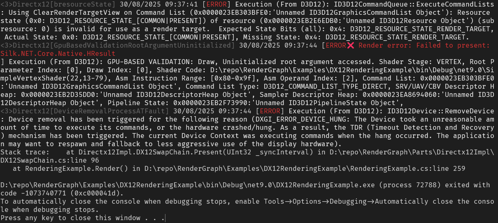

---

marp: true
theme: default
class: invert
paginate: true
header: "Рендер Граф: Система управления процессом рендеринга"
footer: "Top Academy 2025"

---

# Дипломная работа на тему: 
## Рендер Граф: Система управления процессом рендеринга

Выполнил: студент группы ПД212
Мрясов Михаил Сергеевич
Онлайн филиал Top Academy

---

## Проблема и контекст проекта

**Вызов современной компьютерной графики:**
- Рост сложности rendering pipeline'ов с 3-5 до 15-20+ проходов
- Необходимость глубоких знаний DirectX 12, Vulkan для команд приложений
- Высокий риск ошибок при ручном управлении ресурсами и синхронизацией

**Контекст проекта:**
- Компания разрабатывает средства визуализации рекламно-информационных материалов
- Команда разработчиков без глубокой graphics экспертизы
- Неопределенные требования: от базового рендеринга до сложных эффектов
- Необходимость гибкого добавления новых визуальных возможностей

---

## Цель:
Создать библиотеку, снижающую порог входа в graphics programming

---

## Что такое рендер граф

**Определение:**
Рендер граф - декларативная система описания rendering pipeline'а в виде направленного ациклического графа (DAG):
- **Узлы** - render pass'ы (geometry, effects, post-processing)
- **Рёбра** - зависимости через ресурсы

---

## Эволюция подходов:
```
1990-2005: Fixed Pipeline
Vertices → Transform → Lighting → Rasterization

2005-2015: Programmable Shaders  
Geometry → Vertex Shader → Pixel Shader → Output

2015-2020: Multiple Passes
Geometry → G-Buffer → Lighting → Effects → Post-Process

2020+: Render Graphs (Frostbite, Unreal Engine)
Декларативное описание + автоматическая оптимизация
```

---

## Пример современного пайплайна


---

**Сложность современных систем:**
- Множество взаимосвязанных этапов
- Различные форматы и размеры ресурсов  
- Сложные зависимости между проходами
- Необходимость оптимального управления памятью

---

## Проблемы ручной реализации


---

## Типичные ошибки разработчиков без graphics экспертизы:

```cpp
// Проблема 1: Забыли resource transition
SetRenderTarget(colorBuffer);
ApplyBlur(colorBuffer); // ERROR: неправильное состояние ресурса!

// Проблема 2: Неэффективное использование памяти
auto tempBuffer1 = CreateTexture(1920, 1080); // 8MB
auto tempBuffer2 = CreateTexture(1920, 1080); // +8MB
auto tempBuffer3 = CreateTexture(1920, 1080); // +8MB
// Итого: 24MB вместо потенциальных 8MB при переиспользовании

// Проблема 3: Нарушение порядка выполнения
ExecutePass1(); // зависит от результата Pass3
ExecutePass2();
ExecutePass3(); // ERROR: выполняется слишком поздно!
```

---

## Решение через рендер граф

**Декларативный подход:**
```cpp
// Описываем что нужно, а не как делать
var geometryPass = new GeometryPass();
var blurPass = new BlurPass { Input = geometryPass.ColorOutput };
var correctionPass = new ColorCorrectionPass { Input = blurPass.Output };

renderGraph.AddPass(geometryPass);
renderGraph.AddPass(blurPass);
renderGraph.AddPass(correctionPass);

renderGraph.Compile(); // Система сама определит:
                      // - порядок выполнения
                      // - resource transitions
                      // - memory optimization
```

---

**Автоматические гарантии:**
- Корректный порядок выполнения (топологическая сортировка)
- Валидные resource transitions
- Обнаружение циклических зависимостей
- Потенциал для memory aliasing

---

## Архитектура системы


**Трехуровневая архитектура:**

```
┌─────────────────────────────────────────────┐
│              RenderGraph Core               │
│  ┌───────────┐ ┌────────────┐ ┌───────────┐ │
│  │   Graph   │ │ Resource   │ │Dependency │ │
│  │  Manager  │ │  Manager   │ │ Resolver  │ │
│  └───────────┘ └────────────┘ └───────────┘ │
├─────────────────────────────────────────────┤
│               Render Passes                 │
│  ┌───────────┐ ┌────────────┐ ┌───────────┐ │
│  │ Geometry  │ │Post-Process│ │  Future   │ │
│  │   Pass    │ │   Passes   │ │ Extensions│ │
│  └───────────┘ └────────────┘ └───────────┘ │
├─────────────────────────────────────────────┤
│            Graphics API Layer               │
│  ┌───────────┐ ┌────────────┐ ┌───────────┐ │
│  │  Command  │ │  Resource  │ │  Pipeline │ │
│  │  Buffer   │ │Abstraction │ │   State   │ │
│  └───────────┘ └────────────┘ └───────────┘ │
└─────────────────────────────────────────────┘
```

---

## Ключевые алгоритмы

**1. Построение графа зависимостей:**
```cpp
for each pass:
    for each input_resource:
        find producer_pass of input_resource
        add_dependency(pass, producer_pass)
```

**2. Топологическая сортировка:**
- Алгоритм Кана или DFS для определения порядка выполнения
- Обнаружение циклических зависимостей
- Временная сложность: O(V + E)

---

**3. Resource lifetime analysis:**
```cpp
for each resource:
    first_use = min(pass_index using resource)
    last_use = max(pass_index using resource)
    lifetime = [first_use, last_use]
```

**4. Потенциал для aliasing:**
- Ресурсы с непересекающимися lifetime'ами могут использовать общую память
- Graph coloring algorithm для optimal assignment

---

## Реализованные компоненты

**Core система (C#/.NET):**
- `RenderGraph` - главный координатор
- `RenderPass` - базовый класс для всех проходов
- `ResourceManager` - управление lifetime'ами ресурсов
- `DependencyResolver` - топологическая сортировка и валидация

---

**Примеры Render Pass'ов:**
- `GeometryPass` - базовый рендеринг геометрии
- `BlurPass` - Gaussian blur с настраиваемыми параметрами
- `ColorCorrectionPass` - пост-обработка цвета
- Архитектура позволяет легко добавлять новые pass'ы

**Graphics API абстракция:**
- Унифицированный `ICommandBuffer` интерфейс
- Resource descriptions для type-safe работы с ресурсами
- Основа заложена для DirectX 12, потенциал для Vulkan

---

## Пример использования

**Создание simple pipeline'а:**
```csharp
using var device = new DX12GraphicsDevice();
using var renderGraph = new RenderGraph(device);
var geometryPass = new GeometryPas{ViewportWidth = 1920, ViewportHeight = 1080 };
var blurPass = new BlurPass {InputTexture = geometryPass.ColorTarget, BlurRadius = 5.0f };
var colorCorrectionPass = new ColorCorrectionPass{InputTexture = blurPass.OutputTexture, Gamma = 2.2f, Contrast = 1.1f};

renderGraph.AddPass(geometryPass);
renderGraph.AddPass(blurPass);
renderGraph.AddPass(colorCorrectionPass);
renderGraph.Compile();

while (running) {
    using var commandBuffer = device.CreateCommandBuffer();
    renderGraph.Execute(commandBuffer);
    device.Present();
}
```

---

## Преимущества подхода

**Для разработчиков:**
- **Снижение сложности:** Декларативный API вместо императивного
- **Защита от ошибок:** Автоматическая валидация зависимостей
- **Фокус на логике:** Меньше времени на изучение graphics API

---

**Для архитектуры:**
- **Модульность:** Каждый pass изолирован и переиспользуем
- **Тестируемость:** Pass'ы можно тестировать независимо
- **Расширяемость:** Легко добавлять новые эффекты

---

**Потенциал оптимизации:**
- **Resource aliasing:** Переиспользование памяти между pass'ами
- **Barrier optimization:** Минимизация synchronization overhead
- **Dead code elimination:** Автоматическое исключение неиспользуемых pass'ов

---

## Сложность реализации

**Парадокс разработки:**
- ✅ **Алгоритм графа простой:** Топологическая сортировка - стандартный алгоритм
- ❌ **Инфраструктура сложная:** 80% времени тратится на supporting код

**Что оказалось сложным:**
- **Graphics API Abstraction:** Унификация сотен API calls DirectX 12/Vulkan
- **Resource System:** Type-safe работа с текстурами, буферами, view'ами
- **Memory Management:** Интеграция с .NET GC, lifetime tracking
- **Error Handling:** Graceful обработка graphics-специфичных ошибок

---

**Но именно эта инфраструктура:**
- Скрывает сложность от end-пользователей
- Обеспечивает type safety и валидацию
- Создает foundation для future extensions

---

## Ограничения и challenges

**Честно о проблемах:**

**Текущие ограничения:**
- Проект находится в стадии развития
- DirectX 12 backend требует доработки для production use
- Отсутствие comprehensive benchmark'ов
- Limited set реализованных pass'ов

---

**Архитектурные ограничения:**
- Статический анализ - сложности с динамическими pipeline'ами
- Compilation overhead для сложных графов
- Indirection может влиять на debugging experience

---

**Complexity trade-offs:**
- Простота использования vs. flexibility для edge cases
- Automatic optimization vs. manual control для экспертов
- Framework dependency vs. standalone solutions

---

## Применимость и ценность

**Целевые сценарии использования:**
- 🎯 **Команды без graphics экспертизы** (наш случай)
- 🎯 **Проекты с evolving requirements** (рекламная визуализация)
- 🎯 **Средняя сложность pipeline'ов** (5-15 pass'ов)
- 🎯 **Rapid prototyping** визуальных эффектов

---

**НЕ подходит для:**
- ❌ Простейшие проекты (single pass rendering)
- ❌ Команды с deep graphics expertise, предпочитающие полный контроль
- ❌ Extreme performance-critical applications
- ❌ Очень специфичные rendering техники

**Ценность для индустрии:**
- Демократизация доступа к modern rendering techniques
- Accelerated development для non-graphics experts
- Educational value для изучения render graph концептов
- Foundation для более сложных систем

---

## Заключение и выводы

**Что достигнуто:**
- ✅ Разработана working архитектура render graph системы
- ✅ Реализованы core компоненты и несколько example pass'ов
- ✅ Создана foundation для graphics API abstraction
- ✅ Доказана концепция declarative rendering approach

**Практическая значимость:**
- **Для компании:** Потенциал быстрого создания визуальных эффектов
- **Для команды:** Снижение barrier to entry в graphics programming
- **Для индустрии:** Open-source альтернатива для малых команд

---

**Ключевой результат:**
Создана система, которая позволяет разработчикам сосредоточиться на создании визуальных эффектов, а не на изучении сложностей modern graphics API.

**Направления развития:**
- Завершение DirectX 12 implementation
- Расширение библиотеки render pass'ов
- Performance optimization и benchmarking
- Документация и примеры использования

---

**Спасибо за внимание!**